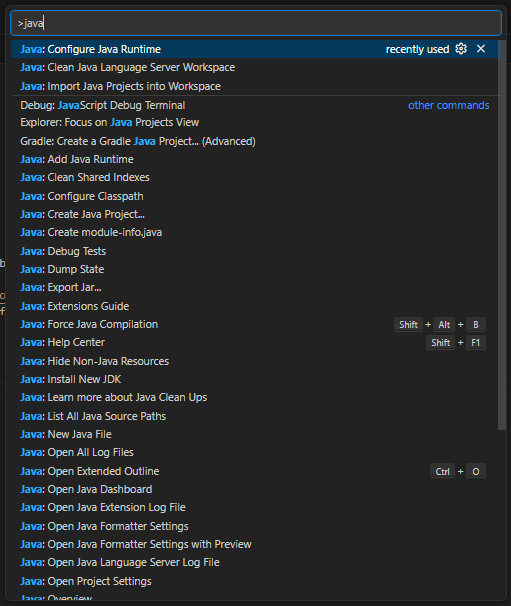
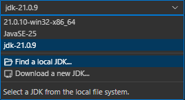

# SDP2 Java Desktop App

## Notice
This ReadMe is for setting up with the use of **Visual Studio Code**.

## Requirements
- Visual Studio Code, **extensions** include:
    * Extension Pack for Java
    * Lombok Annotations Support for VS Code
- Java 21
- Apache Maven
- Back-End SDP2 (other repository)

### Java Version
JDK 21 is required, because of the use of lombok in this project, which does not have compatibility with the latest JDK at this time of writing.

1. Go to [Oracle Archive](https://www.oracle.com/java/technologies/javase/jdk21-archive-downloads.html)
2. Download either the installer or compressed archive for your system (archive recommended if only needed for this project).
    * Installer
        * Since I have only used the archive for setup, this will be up to you to figure out.
    * Archive
        1. In VS Code `Ctrl` + `shift` + `p` (to enter 'Show and run command >')
        2. Search and click on **Java: Configure Java Runtime**

        

        3. Click on **Find a local JDK...**

        

        4. Locate the JDK you downloaded and select the top folder, which contains the folders: bin, conf, include, etc. E.G. If you downloaded the archive for 21.0.9 the folder will be called **jdk-21.0.9**.

### Apache Maven
This project uses maven to build and run with its dependencies.

Go to [Maven Installation](https://maven.apache.org/install.html) and follow the instructions.

## Run

### **! Important !** Make sure you've setup the Back-end for this project, which is found in a seperate repository

